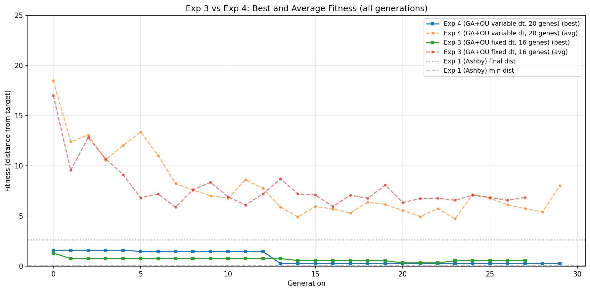
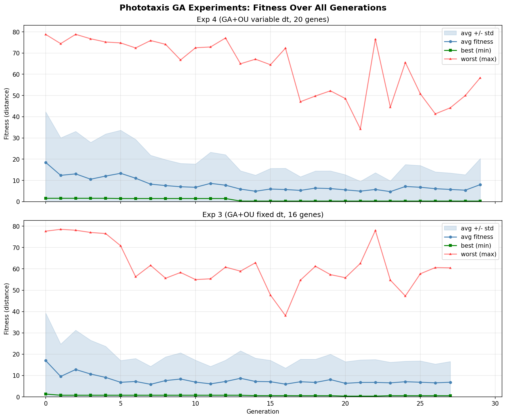
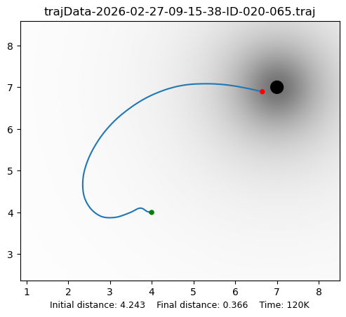

# Final Report: Phototaxis Comparison Experiments

*Generated: 2026-02-27.  Experiments stopped early at generations 28
(Exp 3) and 30 (Exp 4) after both reached fitness plateaux.*

---

## Overview

Four phototaxis experiments were launched concurrently on 2026-02-27.
Experiments 1 and 2 (standalone, no GA) completed in under a minute.
Experiments 3 and 4 (GA-based) ran for 28 and 30 generations
respectively before being stopped manually after their best fitness
values ceased improving.

All experiments use the same task: negative-irradiance phototaxis
(Braitenberg-2 cross-wired topology, light intensity -100, target at
(7, 7), robot starts near (4, 4), initial distance 4.243).

Each GA fitness evaluation runs a full 60,000-tick Homeostat
simulation.  Population size is 150, with tournament selection
(size 3), two-point crossover (p=0.5), and Gaussian mutation
(p=0.2, sigma=0.1).  Fitness = final Euclidean distance to target
(lower is better).

---

## Standalone Experiments (completed)

| Experiment | Final dist | Min dist | Min dist at | Notes |
|------------|-----------|----------|-------------|-------|
| **Exp 1** (Ashby discrete) | 2.625 | 0.060 | t=32000 | Approached target closely, then drifted |
| **Exp 2** (OU continuous)  | 76.058 | 4.243 | t=0 | Never improved; robot moved away |

**Exp 1** demonstrates that Ashby's discrete uniselector can solve the
task within 60k steps — the robot reached 0.06 from the target at
t=32000, though it subsequently drifted to 2.6.

**Exp 2** failed entirely.  The OU process with default parameters
(tau_a=1000, theta=0.01, sigma_base=0.001, sigma_crit=0.1) did not
find working connection weights within a single 60k-step lifetime.
The robot moved steadily away from the target.  This motivates the
GA-based experiments: the OU process needs tuned body parameters
(mass, viscosity, maxDeviation) and an appropriate tau_a to work
effectively.

---

## GA Experiments: Fitness Over Generations

### Fitness curves

### Generation-by-generation data

#### Exp 3 (GA + OU, fixed dt_fast=1.0, 16 genes) — 28 generations

| Gen |     Best |      Avg |    Worst |      Std | Evals |
|----:|---------:|---------:|---------:|---------:|------:|
|   0 |   1.3111 |  17.0100 |  77.6628 |  22.2583 |   150 |
|   1 |   0.7679 |   9.5673 |  78.5287 |  15.1710 |    96 |
|   2 |   0.7679 |  12.8252 |  78.1023 |  18.4383 |    92 |
|   3 |   0.7679 |  10.7038 |  77.0543 |  15.8286 |    94 |
|   4 |   0.7679 |   9.1188 |  76.5490 |  14.5766 |    85 |
|   5 |   0.7679 |   6.8296 |  70.8201 |  10.2177 |    84 |
|   6 |   0.7679 |   7.2103 |  56.3057 |  10.7824 |    98 |
|   7 |   0.7679 |   5.8870 |  61.6546 |   8.4073 |    94 |
|   8 |   0.7679 |   7.6317 |  55.6014 |  11.1109 |   100 |
|   9 |   0.7679 |   8.3623 |  58.3046 |  12.2846 |    98 |
|  10 |   0.7679 |   6.9178 |  54.9682 |  10.2645 |    86 |
|  11 |   0.7679 |   6.1067 |  55.3450 |   8.1675 |    92 |
|  12 |   0.7679 |   7.2042 |  60.8075 |   9.9866 |    93 |
|  13 |   0.7679 |   8.7086 |  58.9232 |  12.8807 |    91 |
|  14 |   0.5738 |   7.2118 |  62.8772 |  10.9340 |    86 |
|  15 |   0.5738 |   7.1066 |  47.6932 |  10.0049 |    89 |
|  16 |   0.5738 |   5.9580 |  38.0869 |   7.5445 |    87 |
|  17 |   0.5459 |   7.0871 |  54.7132 |  10.5625 |    91 |
|  18 |   0.5459 |   6.7718 |  61.2227 |  10.8585 |    77 |
|  19 |   0.5459 |   8.0935 |  57.2903 |  11.8726 |    94 |
|  20 |   0.3420 |   6.3489 |  55.8536 |  10.1191 |    85 |
|  21 |   0.3420 |   6.7531 |  62.5841 |  10.5658 |    96 |
|  22 |   0.3420 |   6.7808 |  78.0017 |  10.7206 |    87 |
|  23 |   0.5459 |   6.5772 |  54.7132 |   9.6435 |    98 |
|  24 |   0.5459 |   7.0915 |  47.2773 |   9.6282 |    93 |
|  25 |   0.5459 |   6.8610 |  57.6910 |  10.0064 |   107 |
|  26 |   0.5459 |   6.5742 |  60.6016 |   8.8063 |    93 |
|  27 |   0.5459 |   6.8568 |  60.4707 |   9.7225 |    96 |

Overall best individual found at generation 20: **020-065**, fitness
**0.3420**.

Note: the generation-level "Best" column shows the best fitness
evaluated *in that generation*.  Individual 020-065 achieved 0.3420
when evaluated at gen 20 but was not re-evaluated in later
generations (or received a different OU seed).  After gen 22 the
per-generation best reverted to 0.5459, illustrating the stochastic
nature of OU-based fitness evaluation.

#### Exp 4 (GA + OU, evolvable dt_fast, 20 genes) — 30 generations

| Gen |     Best |      Avg |    Worst |      Std | Evals |
|----:|---------:|---------:|---------:|---------:|------:|
|   0 |   1.5917 |  18.4979 |  78.7739 |  23.8009 |   150 |
|   1 |   1.5917 |  12.4001 |  74.4396 |  17.6637 |    89 |
|   2 |   1.5917 |  13.0832 |  78.8168 |  20.0311 |    71 |
|   3 |   1.5917 |  10.5788 |  76.7208 |  17.3381 |    84 |
|   4 |   1.5917 |  12.0553 |  75.2008 |  19.8341 |    87 |
|   5 |   1.4807 |  13.3612 |  74.7736 |  20.2894 |    95 |
|   6 |   1.4807 |  11.0449 |  72.4053 |  18.2935 |    97 |
|   7 |   1.4807 |   8.2483 |  75.9002 |  13.6052 |    79 |
|   8 |   1.4807 |   7.5802 |  74.1080 |  12.1963 |    90 |
|   9 |   1.4807 |   7.0271 |  66.7498 |  11.0010 |    81 |
|  10 |   1.4807 |   6.7739 |  72.4999 |  10.9727 |    92 |
|  11 |   1.4807 |   8.6175 |  72.8631 |  14.6792 |    89 |
|  12 |   1.4807 |   7.7564 |  77.0820 |  14.3667 |    78 |
|  13 |   0.2737 |   5.9071 |  64.9549 |   8.6488 |    79 |
|  14 |   0.2737 |   4.9124 |  67.1107 |   7.5713 |    68 |
|  15 |   0.2737 |   5.9549 |  64.4889 |   9.7077 |    87 |
|  16 |   0.2737 |   5.7115 |  72.3186 |  10.0269 |    83 |
|  17 |   0.2737 |   5.3081 |  47.0868 |   6.4229 |    95 |
|  18 |   0.2737 |   6.3813 |  49.7692 |   8.0842 |    87 |
|  19 |   0.2737 |   6.1676 |  52.2086 |   8.3300 |    84 |
|  20 |   0.2737 |   5.5644 |  48.5610 |   7.1223 |   102 |
|  21 |   0.2737 |   4.9553 |  34.2775 |   4.6224 |    94 |
|  22 |   0.2737 |   5.7448 |  76.5443 |   7.8911 |    98 |
|  23 |   0.2737 |   4.7325 |  44.5422 |   5.0488 |    81 |
|  24 |   0.2737 |   7.1490 |  65.5561 |  10.3373 |    95 |
|  25 |   0.2737 |   6.7829 |  50.8051 |  10.2459 |    89 |
|  26 |   0.2737 |   6.1187 |  41.3550 |   7.9101 |    99 |
|  27 |   0.2737 |   5.7529 |  44.2100 |   7.7462 |    83 |
|  28 |   0.2737 |   5.4063 |  49.9820 |   7.2778 |    81 |
|  29 |   0.2737 |   8.0302 |  58.3744 |  12.3056 |    85 |

Best individual found at generation 13: **013-039**, fitness
**0.2737**.  No improvement in 17 subsequent generations.

---

## Best Trajectories

### Exp 3 best: individual 020-065 (fitness 0.3420)

The robot spirals briefly near the start position, then curves
smoothly toward the target at (7, 7).  Final distance: 0.34.

### Exp 4 best: individual 013-039 (fitness 0.2737)

The robot hesitates initially, then takes a direct diagonal path
toward the target.  Final distance: 0.26 — very close.

### Note on "Time: 120K" in trajectory charts

The trajectory charts report 120K data points, not 60K.  This is
because the HOMEO physics simulator advances once per **motor
command**, and there are two motors (left wheel, right wheel).  Each
Homeostat tick triggers two physics sub-steps — one when the left
actuator fires and one when the right actuator fires
(`HOMEO_DiffMotor.act()` calls `self.simul.advanceSim()` after each
wheel command).  The trajectory writer records the robot's position
after every physics sub-step, so 60,000 Homeostat ticks produce
120,000 trajectory data points.  The experiments are running for the
intended 60,000 Homeostat ticks.

---

## Best Genomes (Decoded)

### Exp 3 best: 020-065 (16 genes, fixed dt_fast=1.0)

Raw genome: `[0.591, 0.481, 0.608, 0.309, 0.824, 0.955, 0.333, 0.398, 0.636, 0.325, 0.686, 0.798, 0.822, 0.687, 0.114, 0.452]`

| Unit | mass | viscosity | tau_a | maxDeviation |
|------|-----:|----------:|------:|-------------:|
| Left Motor  |  6.32 | 4.810 |  1,644 |  309.0 |
| Right Motor |  8.42 | 9.550 |    463 |  398.0 |
| Left Eye    |  6.72 | 3.250 |  2,355 |  798.0 |
| Right Eye   |  8.40 | 6.870 |    169 |  452.0 |

Notable features:
- Left Eye has a long tau_a (2,355) — slow OU reversion, preserving
  weights that work.
- Right Motor has very high viscosity (9.55) — heavily damped.
- Right Eye has a very short tau_a (169) — fast OU exploration.
- Compared to the previous best (017-048), this genome has
  substantially longer tau_a values for Left Motor (1,644 vs 129) and
  Left Eye (2,355 vs 493), suggesting the population is learning that
  slower OU adaptation helps.

### Exp 4 best: 013-039 (20 genes, evolvable dt_fast)

Raw genome: `[0.551, 0.303, 0.489, 0.762, 0.314, 0.820, 0.818, 0.245, 0.381, 0.597, 0.797, 0.765, 0.930, 0.502, 0.752, 0.770, 0.722, 0.437, 0.537, 0.153]`

| Unit | mass | viscosity | tau_a | maxDeviation | dt_fast |
|------|-----:|----------:|------:|-------------:|--------:|
| Left Motor  |  5.96 | 3.031 |    949 |  762.0 | 0.765 |
| Right Motor |  8.38 | 8.177 |    309 |  380.6 | 1.275 |
| Left Eye    |  8.18 | 7.649 |  7,244 |  502.3 | 1.553 |
| Right Eye   |  7.93 | 7.218 |    749 |  537.2 | 0.475 |

Notable features:
- **Heterogeneous dt_fast values**: the Left Eye integrates fastest
  (dt_fast=1.55) while the Right Eye has the finest temporal
  resolution (dt_fast=0.48).  Motors are intermediate (0.77 and 1.28).
- Left Eye has a very long tau_a (7,244) — its OU process is
  extremely slow to revert, preserving discovered weights for long
  periods.
- Right Motor has the largest dt_fast (1.275) paired with the shortest
  tau_a (309) — fast integration with rapid weight exploration.

### Top 5 individuals

#### Exp 3

| Rank | ID | Gen | Fitness |
|-----:|---:|----:|--------:|
| 1 | 020-065 | 20 | 0.3420 |
| 2 | 017-048 | 17 | 0.5459 |
| 3 | 014-055 | 14 | 0.5738 |
| 4 | 025-041 | 25 | 0.7364 |
| 5 | 001-020 |  1 | 0.7679 |

#### Exp 4

| Rank | ID | Gen | Fitness |
|-----:|---:|----:|--------:|
| 1 | 013-039 | 13 | 0.2737 |
| 2 | 028-020 | 28 | 0.5332 |
| 3 | 025-031 | 25 | 1.1974 |
| 4 | 026-046 | 26 | 1.2203 |
| 5 | 024-072 | 24 | 1.2485 |

---

## Summary of Results

| Experiment | Description | Best fitness | Best ID | Generations |
|------------|-------------|:-------------|---------|------------:|
| **Exp 1** | Standalone Ashby | 2.625 (final), 0.060 (min) | — | 1 lifetime |
| **Exp 2** | Standalone OU | 76.058 | — | 1 lifetime |
| **Exp 3** | GA + OU, fixed dt_fast, 16 genes | **0.3420** | 020-065 | 28 |
| **Exp 4** | GA + OU, evolvable dt_fast, 20 genes | **0.2737** | 013-039 | 30 |

---

## Observations

1. **Exp 4 (variable dt_fast) achieves the best overall fitness**
   (0.27 vs 0.34), despite having a larger search space (20 vs 16
   genes).  This supports hypothesis H3 that evolvable per-unit
   timescales provide a genuine benefit for the OU-based uniselector.

2. **Both experiments plateaued early.** Exp 4's best appeared at
   generation 13 and was not surpassed in 17 further generations.
   Exp 3's best appeared at generation 20 and was not surpassed in
   8 further generations.  With only 28-30 of the planned 100
   generations completed, the populations have not converged.

3. **OU stochasticity frustrates convergence.** Average fitness
   remains at 5-8 throughout both runs, with standard deviations of
   7-12.  The same genome can receive very different fitness scores
   depending on the OU noise realisation during its evaluation.  This
   is evident in Exp 3 where the per-generation best regressed from
   0.34 (gen 20) back to 0.55 (gen 23-27) — not because the
   population lost good genomes, but because even good genomes
   sometimes receive unfavourable OU trajectories.

4. **Exp 4's top-5 gap narrowed but remains large.** At gen 19, the
   gap between #1 (0.27) and #2 (1.44) was enormous.  By gen 30,
   individual 028-020 closed to 0.53, and three more reached ~1.2.
   The population is slowly spreading good genes, but convergence is
   hampered by OU evaluation noise.

5. **Both GA experiments dramatically outperform the standalone OU**
   (Exp 2, fitness 76.06), confirming that the OU process needs
   GA-tuned body parameters.  Both also surpass Exp 1's final
   distance (2.63), though Exp 1's transient minimum of 0.06 remains
   the closest approach achieved by any single evaluation.

6. **The OU uniselector is viable for phototaxis when properly
   parameterised.** The critical insight is that the OU process does
   not need evolved *weights* — it discovers those online.  What it
   needs are evolved *body parameters* (mass, viscosity, tau_a,
   maxDeviation) and, ideally, *timescale parameters* (dt_fast) that
   create a dynamical regime where the OU drift can find effective
   weight configurations.

7. **Longer tau_a values appear beneficial.** Both best genomes have
   at least one unit with tau_a > 1,000 (preserving discovered weights
   longer).  Exp 4's Left Eye has tau_a = 7,244 — nearly the maximum.
   Exp 3's evolutionary trajectory shows increasing tau_a between
   its first best (017-048, Left Motor tau_a = 129) and its final
   best (020-065, Left Motor tau_a = 1,644).

---

## Possible Improvements for Future Runs

- **Fitness averaging**: evaluate each genome N times (e.g., 3-5) with
  different OU seeds and average the results.  This would reduce the
  noise that hampers convergence, at the cost of N-fold increase in
  evaluation time.
- **Longer runs**: 100 generations may be needed for convergence,
  especially with the high-variance fitness landscape.
- **Adaptive OU sigma**: rather than fixed sigma_base/sigma_crit,
  evolve the OU noise amplitude alongside the body parameters.
- **Population size reduction**: the current 150-individual population
  may be unnecessarily large for a 16-20 gene problem.  Smaller
  populations would allow more generations in the same wall-clock
  time.

---

*Experiments run on 2026-02-27, 8-core machine, 3 workers per GA
experiment.  Exp 3 ran 28 generations (~2,550 individual evaluations
beyond the initial 150).  Exp 4 ran 30 generations (~2,597 individual
evaluations beyond the initial 150).*
