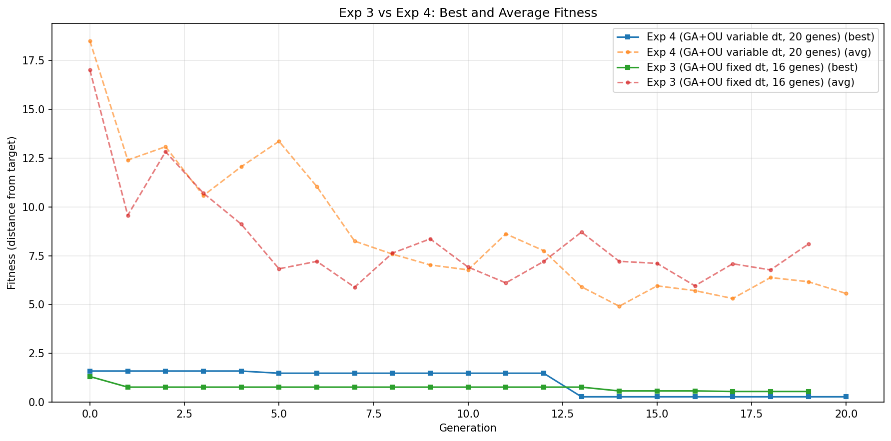
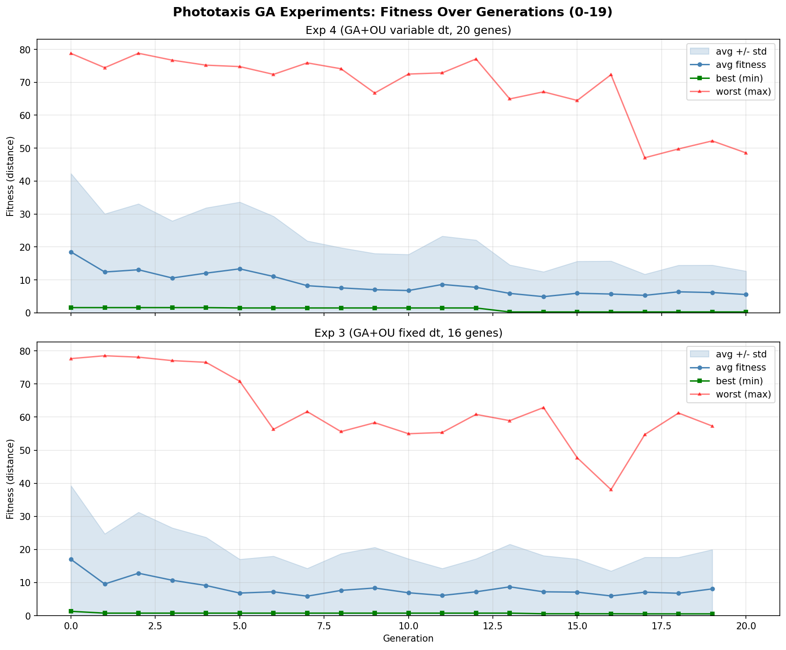
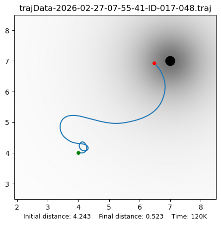
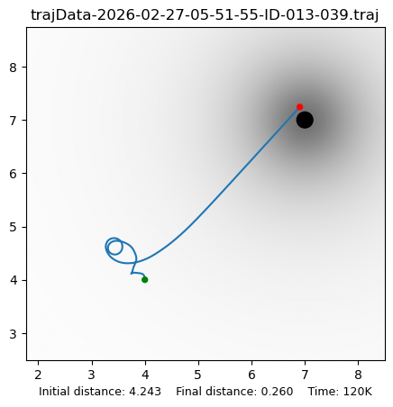

# Provisional Analysis from First 20 Generations

*Generated: 2026-02-27, experiments still running.*

---

## Overview

Four phototaxis experiments were launched concurrently.  Experiments 1
and 2 (standalone, no GA) completed in under a minute.  Experiments 3
and 4 (GA-based) are ongoing; this report covers generations 0 through
19.

All experiments use the same task: negative-irradiance phototaxis
(Braitenberg-2 cross-wired topology, light intensity -100, target at
(7, 7), robot starts near (4, 4), initial distance 4.243).

---

## Standalone Experiments (completed)

| Experiment | Final dist | Min dist | Min dist at | Notes |
|------------|-----------|----------|-------------|-------|
| **Exp 1** (Ashby discrete) | 2.625 | 0.060 | t=32000 | Approached target closely, then drifted |
| **Exp 2** (OU continuous)  | 76.058 | 4.243 | t=0 | Never improved; robot moved away |

**Exp 1** demonstrates that Ashby's discrete uniselector can solve the
task within 60k steps — the robot reached 0.06 from the target at
t=32000, though it subsequently drifted to 2.6.

**Exp 2** failed entirely.  The OU process with default parameters
(tau_a=1000, theta=0.01, sigma_base=0.001, sigma_crit=0.1) did not
find working connection weights within a single 60k-step lifetime.
The robot moved steadily away from the target.  This motivates the
GA-based experiments: the OU process needs tuned body parameters
(mass, viscosity, maxDeviation) and an appropriate tau_a to work
effectively.

---

## GA Experiments: Fitness Over Generations

### Fitness curves

### Generation-by-generation data

#### Exp 3 (GA + OU, fixed dt_fast=1.0, 16 genes)

| Gen |     Best |      Avg |    Worst |      Std | Evals |
|----:|---------:|---------:|---------:|---------:|------:|
|   0 |   1.3111 |  17.0100 |  77.6628 |  22.2583 |   150 |
|   1 |   0.7679 |   9.5673 |  78.5287 |  15.1710 |    96 |
|   2 |   0.7679 |  12.8252 |  78.1023 |  18.4383 |    92 |
|   3 |   0.7679 |  10.7038 |  77.0543 |  15.8286 |    94 |
|   4 |   0.7679 |   9.1188 |  76.5490 |  14.5766 |    85 |
|   5 |   0.7679 |   6.8296 |  70.8201 |  10.2177 |    84 |
|   6 |   0.7679 |   7.2103 |  56.3057 |  10.7824 |    98 |
|   7 |   0.7679 |   5.8870 |  61.6546 |   8.4073 |    94 |
|   8 |   0.7679 |   7.6317 |  55.6014 |  11.1109 |   100 |
|   9 |   0.7679 |   8.3623 |  58.3046 |  12.2846 |    98 |
|  10 |   0.7679 |   6.9178 |  54.9682 |  10.2645 |    86 |
|  11 |   0.7679 |   6.1067 |  55.3450 |   8.1675 |    92 |
|  12 |   0.7679 |   7.2042 |  60.8075 |   9.9866 |    93 |
|  13 |   0.7679 |   8.7086 |  58.9232 |  12.8807 |    91 |
|  14 |   0.5738 |   7.2118 |  62.8772 |  10.9340 |    86 |
|  15 |   0.5738 |   7.1066 |  47.6932 |  10.0049 |    89 |
|  16 |   0.5738 |   5.9580 |  38.0869 |   7.5445 |    87 |
|  17 |   0.5459 |   7.0871 |  54.7132 |  10.5625 |    91 |
|  18 |   0.5459 |   6.7718 |  61.2227 |  10.8585 |    77 |
|  19 |   0.5459 |   8.0935 |  57.2903 |  11.8726 |    94 |

Best individual found at generation 17: **017-048**, fitness **0.5459**.

#### Exp 4 (GA + OU, evolvable dt_fast, 20 genes)

| Gen |     Best |      Avg |    Worst |      Std | Evals |
|----:|---------:|---------:|---------:|---------:|------:|
|   0 |   1.5917 |  18.4979 |  78.7739 |  23.8009 |   150 |
|   1 |   1.5917 |  12.4001 |  74.4396 |  17.6637 |    89 |
|   2 |   1.5917 |  13.0832 |  78.8168 |  20.0311 |    71 |
|   3 |   1.5917 |  10.5788 |  76.7208 |  17.3381 |    84 |
|   4 |   1.5917 |  12.0553 |  75.2008 |  19.8341 |    87 |
|   5 |   1.4807 |  13.3612 |  74.7736 |  20.2894 |    95 |
|   6 |   1.4807 |  11.0449 |  72.4053 |  18.2935 |    97 |
|   7 |   1.4807 |   8.2483 |  75.9002 |  13.6052 |    79 |
|   8 |   1.4807 |   7.5802 |  74.1080 |  12.1963 |    90 |
|   9 |   1.4807 |   7.0271 |  66.7498 |  11.0010 |    81 |
|  10 |   1.4807 |   6.7739 |  72.4999 |  10.9727 |    92 |
|  11 |   1.4807 |   8.6175 |  72.8631 |  14.6792 |    89 |
|  12 |   1.4807 |   7.7564 |  77.0820 |  14.3667 |    78 |
|  13 |   0.2737 |   5.9071 |  64.9549 |   8.6488 |    79 |
|  14 |   0.2737 |   4.9124 |  67.1107 |   7.5713 |    68 |
|  15 |   0.2737 |   5.9549 |  64.4889 |   9.7077 |    87 |
|  16 |   0.2737 |   5.7115 |  72.3186 |  10.0269 |    83 |
|  17 |   0.2737 |   5.3081 |  47.0868 |   6.4229 |    95 |
|  18 |   0.2737 |   6.3813 |  49.7692 |   8.0842 |    87 |
|  19 |   0.2737 |   6.1676 |  52.2086 |   8.3300 |    84 |
|  20 |   0.2737 |   5.5644 |  48.5610 |   7.1223 |   102 |

Best individual found at generation 13: **013-039**, fitness **0.2737**.

---

## Best Trajectories

### Exp 3 best: individual 017-048 (fitness 0.5459)

The robot spirals briefly near the start position, then curves
smoothly toward the target at (7, 7).  Final distance: 0.52.

### Exp 4 best: individual 013-039 (fitness 0.2737)

The robot hesitates initially, then takes a direct diagonal path
toward the target.  Final distance: 0.26 — very close.

### Note on "Time: 120K" in trajectory charts

The trajectory charts report 120K data points, not 60K.  This is
because the HOMEO physics simulator advances once per **motor
command**, and there are two motors (left wheel, right wheel).  Each
Homeostat tick triggers two physics sub-steps — one when the left
actuator fires and one when the right actuator fires
(`HOMEO_DiffMotor.act()` calls `self.simul.advanceSim()` after each
wheel command).  The trajectory writer records the robot's position
after every physics sub-step, so 60,000 Homeostat ticks produce
120,000 trajectory data points.  The experiments are running for the
intended 60,000 Homeostat ticks.

---

## Best Genomes (Decoded)

### Exp 3 best: 017-048 (16 genes, fixed dt_fast=1.0)

Raw genome: `[0.591, 0.399, 0.055, 0.335, 0.790, 0.005, 0.334, 0.398, 0.537, 0.801, 0.346, 0.465, 1.000, 0.452, 0.225, 0.452]`

| Unit | mass | viscosity | tau_a | maxDeviation |
|------|-----:|----------:|------:|-------------:|
| Left Motor  |  6.32 | 3.990 |   128.7 |  335.3 |
| Right Motor |  8.11 | 0.046 |   464.5 |  398.2 |
| Left Eye    |  5.84 | 8.010 |   492.8 |  464.8 |
| Right Eye   | 10.00 | 4.522 |   281.3 |  452.5 |

Notable features:
- Right Motor has near-zero viscosity (0.046) — almost frictionless.
- Left Motor has a very short tau_a (129) — fast OU adaptation.
- Right Eye has the highest mass (10.0) — heavy, slow to respond.

### Exp 4 best: 013-039 (20 genes, evolvable dt_fast)

Raw genome: `[0.551, 0.303, 0.489, 0.762, 0.314, 0.820, 0.818, 0.245, 0.381, 0.597, 0.797, 0.765, 0.930, 0.502, 0.752, 0.770, 0.722, 0.437, 0.537, 0.153]`

| Unit | mass | viscosity | tau_a | maxDeviation | dt_fast |
|------|-----:|----------:|------:|-------------:|--------:|
| Left Motor  |  5.96 | 3.031 |    948.8 |  761.8 | 0.765 |
| Right Motor |  8.38 | 8.177 |    309.1 |  380.6 | 1.275 |
| Left Eye    |  8.18 | 7.649 |  7,244.3 |  502.3 | 1.553 |
| Right Eye   |  7.93 | 7.218 |    748.5 |  537.2 | 0.475 |

Notable features:
- **Heterogeneous dt_fast values**: eyes are faster (1.28-1.55) than
  motors (0.48-0.77).  The right eye has the smallest dt_fast (0.475),
  meaning finest temporal resolution.
- Left Eye has a very long tau_a (7,244) — its OU process is extremely
  slow to revert, preserving discovered weights for long periods.
- Right Motor has the largest dt_fast (1.275) and shortest tau_a (309)
  — fast integration with rapid weight adaptation.

### Top 5 individuals

#### Exp 3

| Rank | ID | Fitness |
|-----:|---:|--------:|
| 1 | 017-048 | 0.5459 |
| 2 | 014-055 | 0.5738 |
| 3 | 001-020 | 0.7679 |
| 4 | 006-092 | 0.8258 |
| 5 | 014-076 | 1.0253 |

#### Exp 4

| Rank | ID | Fitness |
|-----:|---:|--------:|
| 1 | 013-039 | 0.2737 |
| 2 | 015-027 | 1.4381 |
| 3 | 005-094 | 1.4807 |
| 4 | 010-028 | 1.5189 |
| 5 | 000-019 | 1.5917 |

---

## Preliminary Observations

1. **Exp 4 (variable dt_fast) leads Exp 3 (fixed dt_fast)** in best
   fitness (0.27 vs 0.55), despite having a larger search space (20 vs
   16 genes).  This supports hypothesis H3 that evolvable timescales
   provide a genuine benefit.

2. **Neither experiment has fully plateaued.** Exp 3's best improved
   from 0.77 to 0.55 between generations 14 and 17.  Exp 4's best
   jumped from 1.48 to 0.27 at generation 13 — a dramatic improvement
   from a single individual.  Both could still improve with more
   generations.

3. **High population variance persists.** Average fitness is still
   5-8 in both experiments, with worst individuals at 40-70.  The
   populations have not converged.  This suggests the OU weight
   adaptation introduces stochasticity into fitness evaluations: the
   same genome may produce different fitness values depending on the
   OU noise seed, making it harder for the population to converge.

4. **Exp 4's top-5 gap is large.** The best individual (0.27) is far
   ahead of the second-best (1.44).  This could indicate a lucky OU
   realisation rather than a robustly superior genome — or it could be
   a genuinely good parameter combination that the population will
   converge toward in later generations.

5. **Both GA experiments already outperform Exp 2** (standalone OU,
   fitness 76.06) and are approaching or surpassing Exp 1 (standalone
   Ashby, fitness 2.63).  Exp 4's best (0.27) is substantially closer
   to the target than Exp 1's final distance, though not as close as
   Exp 1's best approach of 0.06 during its run.

6. **The OU process needs GA-tuned parameters.** Exp 2's complete
   failure versus the GA experiments' success confirms that the OU
   uniselector's effectiveness depends critically on body parameters
   (mass, viscosity, tau_a, maxDeviation).

---

*This is a provisional analysis.  Final results will be available
after all 100 generations complete for both GA experiments.*
