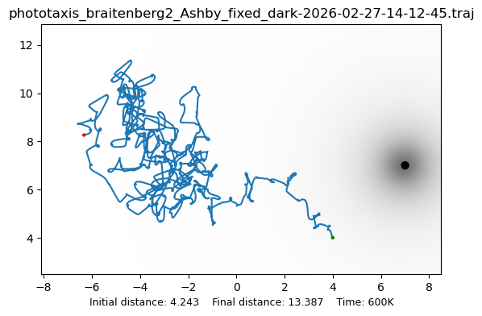
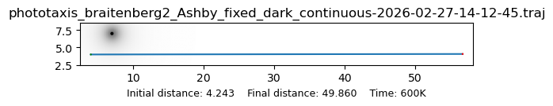
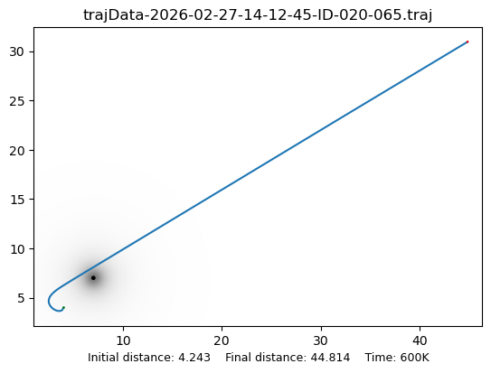

# Validation Experiment: 300k Steps

*Generated: 2026-02-27.*

---

## Overview

This experiment re-runs the best individual from each of the four
phototaxis experiments for 5x longer (300,000 simulated seconds
instead of 60,000), testing whether the adaptive mechanisms can
sustain proximity to the target over extended time.

All experiments use the same environment: negative-irradiance
phototaxis, Braitenberg-2 cross-wired topology, light intensity -100,
target at (7, 7), robot starts at (4, 4), initial distance 4.243.

**Exp 1 & 2** restore the homeostat's final connection weights from
the saved JSON condition files of the original 60k runs.  The
uniselectors remain active, so the Ashby stepping switch (Exp 1) and
OU drift (Exp 2) continue to modify weights during the 300k run.

**Exp 3 & 4** replay the best GA genomes.  Body parameters (mass,
viscosity, tau_a, maxDeviation, and dt_fast for Exp 4) are set from
the genome; connection weights are initialized randomly and discovered
online by the OU process, exactly as during GA fitness evaluation.

---

## Results Summary

| Exp | Description | Min dist | Min at (tick) | Final dist (300k) |
|-----|-------------|---------|---------------|-------------------|
| **1** | Ashby (restored weights) | 3.993 | t=2k | 13.387 |
| **2** | OU standalone (restored weights) | 2.996 | t=17k | 49.860 |
| **3** | GA+OU fixed dt (genome 020-065) | 0.931 | t=49k | 44.814 |
| **4** | GA+OU variable dt (genome 013-039) | 3.419 | t=33k | 326.485 |

For comparison, the original 60k results:

| Exp | Original best approach | Original final dist |
|-----|----------------------|-------------------|
| **1** | 0.060 (t=32k) | 2.625 |
| **2** | 4.243 (t=0, never improved) | 76.058 |
| **3** | 0.342 (fitness of genome 020-065) | — |
| **4** | 0.274 (fitness of genome 013-039) | — |

---

## Distance Over Time

The top panel shows the full 300k run; the bottom panel zooms into
the first 80k ticks where the interesting behavior occurs.  All four
experiments follow the same pattern: a brief period of approach
followed by steady, monotonic drift away from the target.

---

## Trajectory Plots

### Exp 1: Ashby (restored weights)

The robot spirals outward from the start.  The restored weights (from
the end of the original 60k run, where the Ashby had already drifted
from its best configuration) do not help — the uniselector continues
to randomize weights whenever a unit exceeds its critical threshold,
and the new random weights move the robot away.

Note: the original 60k run reached 0.06 at t=32k, but by t=60k it
had drifted to 2.625.  We restored the t=60k weights, not the t=32k
weights.  The Ashby uniselector does not preserve its best
configuration — it only knows "within bounds" vs "out of bounds".

### Exp 2: OU standalone (restored weights)

The OU briefly improves to 3.0 at t=17k (better than the original
run, which never improved at all), then drifts steadily away.  The
default OU parameters (tau_a=1000, sigma_base=0.001, sigma_crit=0.1)
produce continuous weight drift that overwhelms any good configuration
the system discovers.

### Exp 3: GA+OU fixed dt (genome 020-065)

The best result of the four: the OU finds effective weights around
t=40-50k, driving the robot to within 0.93 of the target.  But the
OU drift then pushes the weights away, and the robot spirals outward.
By t=300k it has reached distance 44.8.

The GA-tuned body parameters (tau_a up to 2,355 for the Left Eye)
give the OU enough stability to find and briefly hold good weights,
but not enough to maintain them indefinitely.

### Exp 4: GA+OU variable dt (genome 013-039)

Despite having the best 60k fitness (0.274), this genome performs
worst over 300k steps.  The robot drifts away starting around t=40k
and reaches distance 326 by t=300k.  The high dt_fast values
(up to 1.55 for the Left Eye) may amplify the OU drift, causing
faster weight divergence.  The long tau_a of 7,244 on the Left Eye,
which helped preserve good weights during the 60k evaluation, is not
sufficient to counteract the compounding drift over 300k steps.

---

## Analysis

### 1. All adaptive mechanisms are transiently effective

Every experiment (except Exp 1, which started from degraded weights)
shows a period of approach toward the target.  The OU process in
Exp 3 reaches 0.93, comparable to its 60k fitness of 0.34.  But none
can *maintain* proximity.  The adaptive mechanisms are designed to
search, not to stabilize: once good weights are found, the same
process that found them continues to modify them.

### 2. The Ashby and OU uniselectors lack a "latch" mechanism

Ashby's original homeostat had uniselectors that only fired when the
essential variable left its viable range.  If the system found a
stable configuration (all units within bounds), the uniselectors
would stop.  In the phototaxis task, however, the robot must
*actively move* toward the target, which means the essential
variables are continuously driven by sensory input and never fully
settle.  The uniselectors keep firing and eventually randomize away
from good configurations.

### 3. OU drift is not self-correcting

The OU process reverts toward zero (theta=0.01), but "zero weights"
is not a useful configuration for phototaxis.  As weights drift
toward zero, the robot stops responding to light, moves randomly, and
the OU continues drifting.  There is no gradient signal to pull the
weights back toward effective values — the OU is a random walk with
a bias toward zero, not toward good performance.

### 4. Fitness over a single 60k evaluation is misleading

The GA evaluated each genome over a single 60k-step lifetime.  The
fitness value (final distance at t=60k) captures a snapshot of where
the OU happened to be in its random walk at that moment.  Exp 4's
fitness of 0.274 was an especially lucky OU realisation — the same
genome produces distance 326 over 300k steps because the OU
eventually wanders away from the good configuration.

This explains the high fitness variance observed in the GA
experiments (std of 7-12 across the population): the same genome
can receive very different fitness values depending on the OU
trajectory.

### 5. Longer tau_a helps but does not solve the problem

Exp 3's genome (tau_a up to 2,355) held good weights longer than
Exp 4's genome (tau_a up to 7,244) — paradoxically, because Exp 4's
larger dt_fast values amplified the displacement from weight drift.
Longer tau_a slows the OU drift but cannot eliminate it.  The
fundamental issue is that the OU process has no feedback from
performance: it drifts at the same rate whether the robot is near
the target or far away.

---

## Implications for Future Work

1. **Fitness averaging across multiple OU seeds** would give more
   robust genome evaluations and reduce the impact of lucky/unlucky
   OU realisations.

2. **Performance-dependent OU sigma** could slow the drift when
   the robot is performing well (units within bounds) and increase
   exploration when performance is poor.  This would create a
   "soft latch" that preserves good configurations without fully
   stopping adaptation.

3. **Periodic fitness checkpointing** during a run — saving the
   homeostat state at the point of minimum distance, not just at
   the end — would allow restarting from the best configuration.

4. **Larger tau_a values** (10,000-100,000) combined with smaller
   dt_fast could slow the effective drift rate enough to maintain
   good weights for 300k steps, at the cost of slower initial
   convergence.

---

*Validation run on 2026-02-27, 300k simulated seconds per experiment,
4 concurrent subprocesses.  Total wall-clock time: ~3 minutes.*
